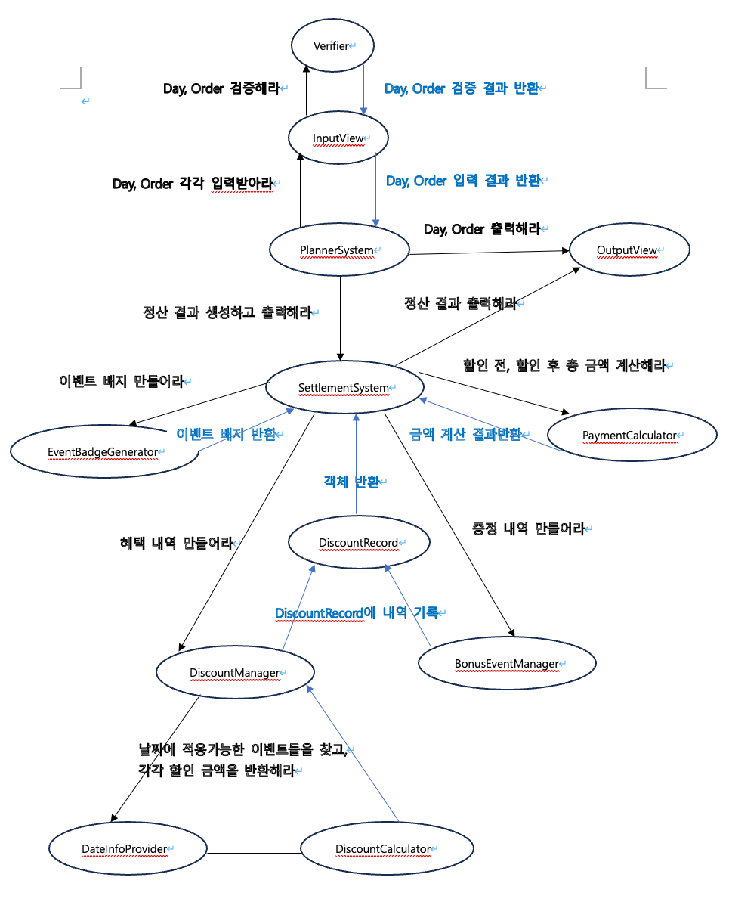

## 📝 구현 대상

### 크리스마스 프로모션

### - 목표

=> 변화에 유동적으로 대응하기 쉽고 객체지향의 이점을 살릴 수 있는 12월 이벤트 플래너를 만든다.
중앙처리식 시스템보다는 객체와 객체가 서로 협력하는, '살아있는' 시스템을 구성한다. 또한, 모든 도메인 로직에 단위 테스트를 작성함으로써 시스템의 무결성을 보장한다.

### - 세부 목표 및 지침

- 클래스보다는 메시지 중심 설계
- UI는 도메인 로직과 분리
- 단일 책임 원칙을 지키자
- 클래스 분리 및 역할 부여
- 역할, 책임, 협력 설계
- 인스턴스 변수의 수를 줄이기 위해 노력하자
- 무분별한 getter 사용 대신 객체에 메시지를 보내 객체가 로직을 수행하도록 하자
- 객체는 객체스럽게 사용하자
- 단위 테스트하기 어려운 코드를 단위 테스트해보자

---

### - 설계

#### 1차 단계 (메세지 다이어그램 구성)

#### 기능 명세

- 입력

> [기능] 방문 날짜를 입력받는 기능 
> [기능] 주문할 메뉴와 갯수를 입력받는 기능 

- 출력

> [기능] 주문 메뉴를 출력하는 기능 
> [기능] 할인 전 총 주문 금액 출력하는 기능 
> [기능] 증정 메뉴를 출력하는 기능 
> [기능] 혜택 내역 출력하는 기능 
> [기능] 총혜택 금액을 출력하는 기능 
> [기능] 할인 후 예상 결제 금액을 출력하는 기능 
> [기능] 12월 이벤트 배지를 출력하는 기능 

- 로직

> [기능] 메뉴판을 만드는 기능 
> [기능] 증정 메뉴를 만드는 기능  
> [기능] 주문을 입력 받는 기능  
> [기능] 주문 내역을 생성하는 기능  
> [기능] 주문 내역에 메뉴를 추가하는 기능  
> [기능] 날짜를 입력받는 기능 
> [기능] 날짜를 반환하는 기능 
> [기능] 날짜가 금요일인지 체크하는 기능 
> [기능] 날짜가 토요일인지 체크하는 기능 
> [기능] 날짜가 일요일인지 체크하는 기능 
> [기능] 날짜가 크리스마스인지 체크하는 기능 
> [기능] 날짜가 크리스마스 디데이 기간인지 체크하는 기능 
> [기능] 날짜가 평일인지 체크하는 기능 
> [기능] 날짜가 주말인지 체크하는 기능 
> [기능] 날짜가 별을 가지는지 체크하는 기능 
> [기능] 주문 메뉴를 바탕으로 할인 전 총주문 금액을 계산하는 기능 
> [기능] 이벤트를 적용 가능한지 체크하는 기능 
> [기능] 방문 날짜가 크리스마스 디데이 할인을 받는지 체크하는 기능 
> [기능] 방문 날짜에 평일 할인을 받는지 체크하는 기능 
> [기능] 방문 날짜에 주말 할인을 받는지 체크하는 기능 
> [기능] 방문 날짜에 특별 할인을 받을 수 있는지 체크하는 기능 
> [기능] 증정 이벤트를 받을 수 있는지 체크하는 기능 
> [기능] 크리스마스 디데이 할인 금액을 계산하는 기능 
> [기능] 평일 할인 금액을 계산하는 기능 
> [기능] 주말 할인 금액을 계산하는 기능 
> [기능] 특별 할인 금액을 계산하는 기능 
> [기능] 증정 메뉴의 가격을 계산하는 기능 
> [기능] 혜택 내역을 생성하는 기능  
> [기능] 혜택 내역에 할인 이벤트 내역을 기록하는 기능 
> [기능] 혜택 내역을 반환하는 기능 
> [기능] 총혜택 금액을 계산하는 기능 
> [기능] 할인 후 예상 결제 금액을 계산하는 기능 
> [기능] 총혜택 금액에 따라 이벤트 베지를 만드는 기능 
> [기능] 금액을 ###.##0 형식으로 포매팅하는 기능 

- 예외
  1. 입력받은 방문 날짜 대한 예외처리
  > [예외] 방문 날짜가 숫자가 아닌 경우 
  [예외] 방문 날짜가 자료형의 범위를 벗어나는 경우 
  [예외] 방문 날짜가 1~31을 벗어나는 경우 
  2. 입력받은 주문 메뉴에 대한 예외처리
  > [예외] 메뉴판에 없는 메뉴를 입력한 경우 
  > [예외] 입력한 메뉴의 갯수가 1 이상의 숫자가 아닌 경우 
  > [예외] 메뉴 형식이 예시와 다른 경우 
  > [예외] 중복 메뉴를 입력한 경우 
  3. 런타임 예외처리
  > [예외] 음료만 주문한 경우 
  > [예외] 주문내역이 20개를 초과하는 경우 
  > 입력받은 당첨 번호와 보너스 번호가 중복되는 경우 

---

