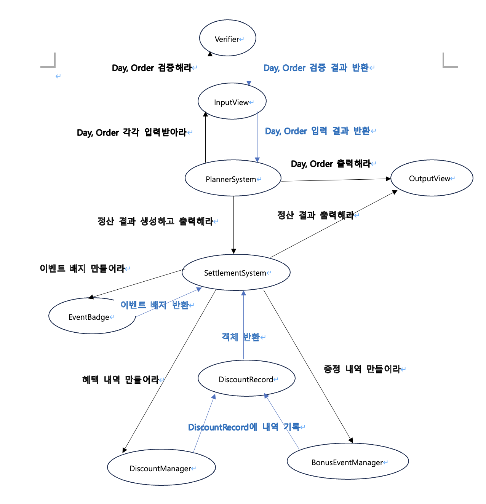

## 📝 구현 대상

### 크리스마스 프로모션

### - 목표

=> 유연성과 확장성을 강조한 12월 이벤트 플래너를 개발하여 변화에 대응하고, 객체지향의 장점을 최대한 활용한다. 
중앙처리식 시스템이 아닌 객체 간의 협력을 강조하여 '살아있는' 시스템을 설계하고, 
모든 도메인 로직에 철저한 단위 테스트를 도입하여 시스템의 무결성을 보장한다. 
이를 통해 확장성 있고 유지보수가 용이한 효과적인 이벤트 플래너를 구축한다.

### - 세부 목표 및 지침

- 클래스보다는 메시지 중심 설계
- UI는 도메인 로직과 분리
- 단일 책임 원칙을 지키자
- 의존성 역전 원칙을 지키자
- 클래스 분리 및 역할 부여
- 역할, 책임, 협력 설계
- 인스턴스 변수의 수를 줄이기 위해 노력하자
- 무분별한 getter 사용 대신 객체에 메시지를 보내 객체가 로직을 수행하도록 하자
- 객체는 객체스럽게 사용하자
- 단위 테스트하기 어려운 코드를 단위 테스트해보자

---

### - 설계

#### 1차 단계 (메세지 다이어그램 구성)

#### 기능 명세

- 입력

> [기능] 방문 날짜를 입력받는 기능 
> [기능] 주문할 메뉴와 갯수를 입력받는 기능 

- 출력

> [기능] 고객에게 안내할 이벤트 주의사항을 출력하는 기능
> - 총주문 금액 10,000원 이상부터 이벤트가 적용된다고 출력하는 기능 
> - 음료만 주문 시, 주문할 수 없다고 출력하는 기능 
> - 메뉴는 한 번에 최대 20개까지만 주문할 수 있다고 출력하는 기능 

> [기능] 이벤트 플래너 실행 결과 출력하는 기능
> - 주문 메뉴를 출력하는 기능 
> - 할인 전 총 주문 금액 출력하는 기능 
> - 증정 메뉴를 출력하는 기능 
> - 혜택 내역 출력하는 기능 
> - 총혜택 금액을 출력하는 기능 
> - 할인 후 예상 결제 금액을 출력하는 기능 
> - 12월 이벤트 배지를 출력하는 기능 

> [기능] 에러 메시지 출력하는 기능
> - 예외 명세서에 명시된 예외에 대한 메시지를 출력하는 기능

- 로직

> [기능] 메뉴 관련 기능  
> - 메뉴 목록을 만드는 기능 
> - 메뉴의 이름을 반환하는 기능  
> - 메뉴의 가격을 반환하는 기능  
> - 메뉴의 타입(에피타이저/메인/디저트/음료)을 반환하는 기능 
> - 메뉴 이름을 기반으로 메뉴 객체를 가져오는 기능 

> [기능] 증정 메뉴 관련 기능  
> - 증정 메뉴 목록을 만드는 기능 
> - 증정 메뉴의 이름을 반환하는 기능 
> - 증정 메뉴의 총가격(가격 * 수량)을 반환하는 기능 
> - 증정 메뉴 목록의 총 가격을 반환하는 기능 
> - 출력할 증정 메뉴 정보를 만드는 기능 

> [기능] 주문 관련 기능  
> - 주문 항목 하나의 총가격(가격 * 수량)을 계산하는 기능 
> - 주문 항목의 이름을 반환하는 기능 
> - 주문 항목의 수량을 반환하는 기능 
> - 주문 항목의 메뉴 타입을 반환하는 기능 
> - 주문에 주문 항목을 추가하는 기능  
> - 주문 항목들을 반환하는 기능  
> - 총 주문 금액(할인 전 총 주문 금액)을 계산하는 기능 
> - 출력할 주문 정보를 만드는 기능 

> [기능] 날짜 관련 기능  
> - 날짜를 반환하는 기능 
> - 날짜가 금요일인지 체크하는 기능 
> - 날짜가 토요일인지 체크하는 기능 
> - 날짜가 일요일인지 체크하는 기능 
> - 날짜가 크리스마스인지 체크하는 기능 
> - 날짜가 크리스마스 디데이 기간인지 체크하는 기능 
> - 날짜가 평일인지 체크하는 기능 
> - 날짜가 주말인지 체크하는 기능 
> - 날짜가 별을 가지는지 체크하는 기능 

> [기능] 이벤트 할인과 관련된 기능  
> - 방문 날짜의 크리스마스 디데이 할인 금액을 계산하는 기능 
> - 방문 날짜의 평일 할인 금액을 계산하는 기능 
> - 방문 날짜의 주말 할인 금액을 계산하는 기능 
> - 방문 날짜의 특별 할인 금액을 계산하는 기능 

> [기능] 증정 이벤트와 관련된 기능  
> - 증정 이벤트를 적용 가능한지 체크하는 기능 
> - 증정 이벤트로 혜택본 금액을 계산하는 기능 

> [기능] 혜택 내역과 관련된 기능  
> - 주문에 이벤트를 적용 가능한지 체크하는 기능 
> - 혜택 내역을 생성하는 기능  
> - 총 혜택 금액을 반환하는 기능 
> - 할인 후 예상 결제 금액을 반환하는 기능 
> - 출력할 혜택 내역 정보를 만드는 기능 

> [기능] 이벤트 배지와 관련된 기능 
> - 총혜택 금액에 따라 이벤트 베지를 만드는 기능 
> - 이벤트 배지를 반환하는 기능 

> [기능] 기타 기능  
> - 입력한 주문을 바탕으로 주문 객체를 만드는 기능 
> - 금액을 ###.##0 형식으로 포매팅하는 기능 

- 예외
> [예외] 입력받은 방문 날짜 대한 예외처리
> - 방문 날짜가 숫자가 아닌 경우 
> - 방문 날짜가 1~31을 벗어나는 경우 

> [예외] 입력받은 주문 메뉴에 대한 예외처리
> - 메뉴 형식이 예시와 다른 경우 
> - 메뉴판에 없는 메뉴를 입력한 경우 
> - 중복 메뉴를 입력한 경우 
> - 입력한 메뉴의 갯수가 1 이상의 숫자가 아닌 경우 

> [예외] 런타임 예외처리
> - 주문내역이 20개를 초과하는 경우 
> - 음료만 주문한 경우 
  
---
### - 최종 클래스 다이어그램

